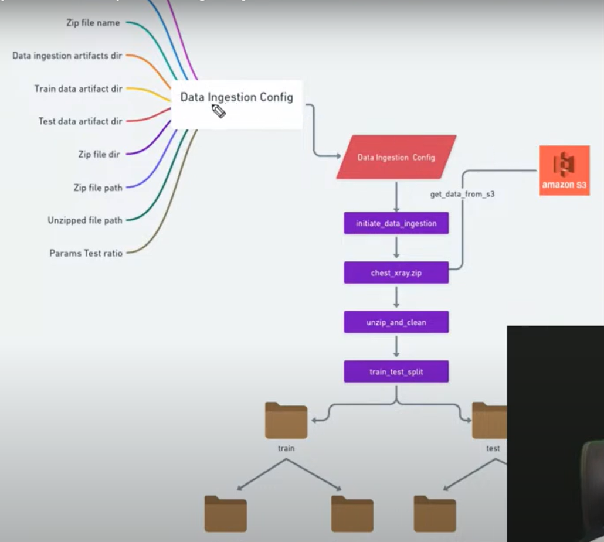

# dlproject1
This is the implementation of end to end deep learning project

## Workflows

- constants
- congif_entity
- components
- pipeline
- main

## Github shortcuts:

Open terminal or git bash not powershell and cd directory where we need to create project and use mkdir dlproject1. Then go to github and create one repository by adding README file, .gitignore, license. Then do go to dlproject1 and do git clone path, and then open vs code by typing "code .". Once vs code is opened, do git initialization using below:

git init
git add README.md
git commit -m "first commit"
git branch -M main
git remote add origin git@github.com:Kmvucd/dlproject1.git
git push -u origin main

Now, git is synced with the vs code and the dlproject1 folder.

If any changes are done, steps are:
git add .
git status
git commit -m "Comments"
git push -u origin main

## How to setup 

1. Creating virtual environment
conda create -n venv python=3.8 -y

2. Activate venv
conda activate venv

3. Run requirements file
pip install -r requirements.txt

4. Setup AWS CLI
First, open aws console, and search with S3 and create bucket, Give unique bucket name and keep bucket type as "General purpose". Then dont make any changes and then click Create Bucket. Now, we are going to download access keys csv file, so search with "IAM" and then users, create user-> User Name -> Next -> Attach policies directly -> and below search with admin -> sekect AWS managed - job f... type -> Next -> click Create User. Once created, go into new user, then Create access key -> select CLI -> Tick confirmation -> Next -> Create access key -> Download .csv file

Download AWS CLI for windows and then install and usually it will be in ProgramFiles/Amazon. Need to create environment variables as user path.

5. In VS terminal, run aws --version, it will show version, else vs not recognizing CLI.

6. AWS Configuration
aws configure
Now, it will ask for access key and secret access key and region, use downloaded accesskeys from S3 bucket, and use them to configure my local to S3 bucket.

7. Data Ingestion Flowchart

